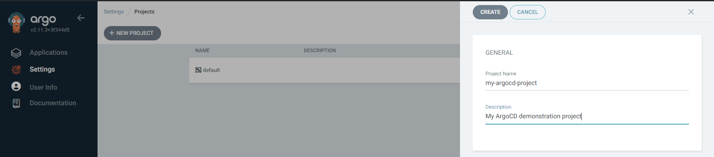
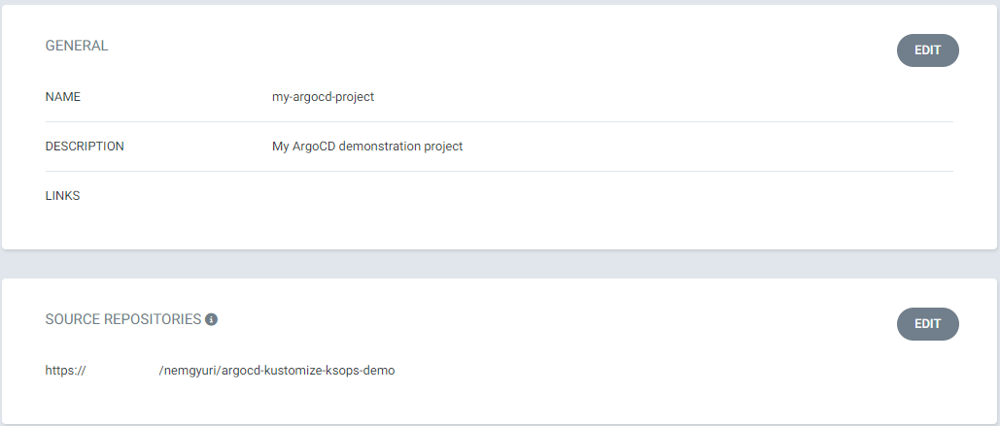
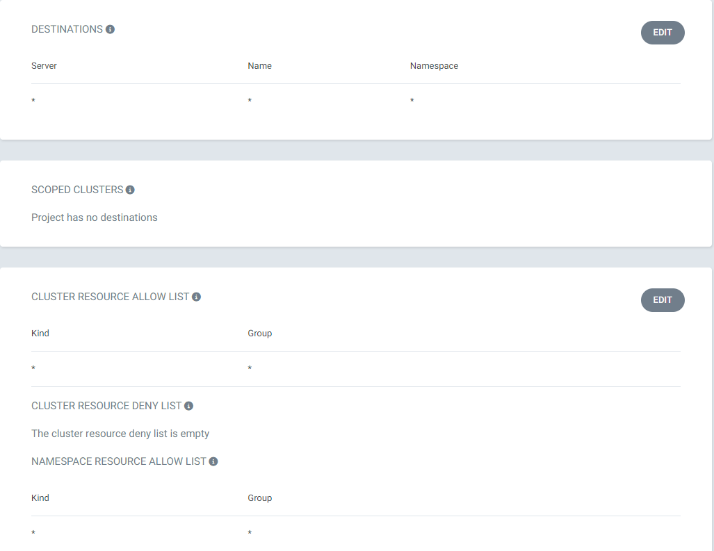
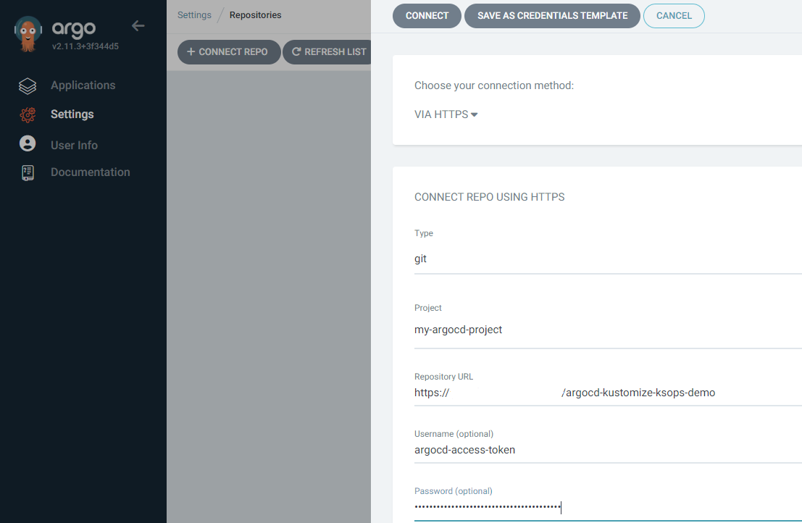
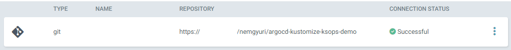
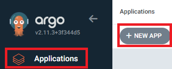
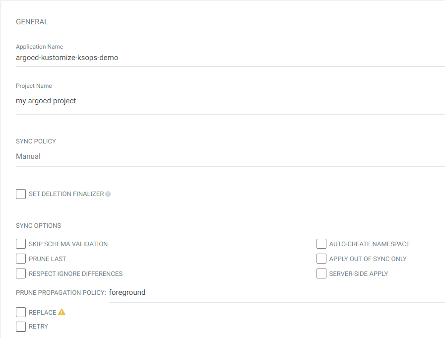
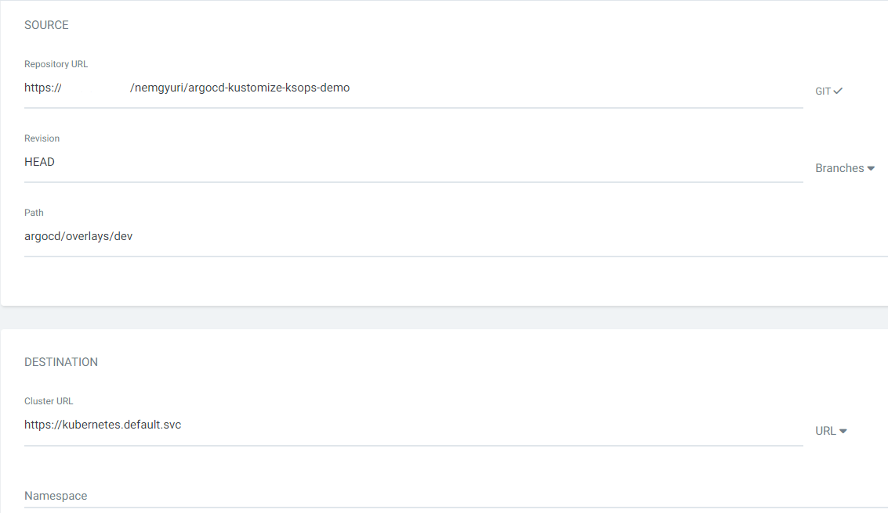
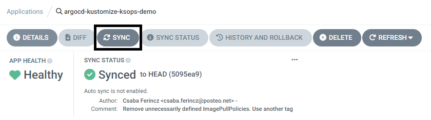

# Demo project for trying out ArgoCD with ksops and kustomize

## Short summary
This example project demonstrates the following things:
- Setup ArgoCD for gitops with secrets management
- Encryption of secrets conveniently and securely with SOPS
- Usage of Kustomize and its overlays to apply stage-specific configurations with ease

## Preface
Generally it's not advisable to push sensitive data (credentials) into git repositories unencrypted. \
A convenient method for such kind of secret management is the usage of SOPS which can encrypt and decrypt data with a variety of methods. \
In this demo project PGP is used as encryption mechanism/layer.

We also want to use ArgoCD for GitOps approach, but it doesn't have a built-in secrets management. \
Therefore we need to "enhance" our ArgoCD setup so that it supports SOPS and on-the-fly decryption of SOPS-encrypted secrets stored in Git.

Kustomize will be used for generating stage-specific variables and configurations with its "overlay"-s. \
ArgoCD must be able to build overlays and apply the configurations even when SOPS-encrypted secrets are in use.\
For that purpose the Kustomize plugin `ksops` from viaduct.ai should be integrated into our ArgoCD installation.

## How to try it out
### Install a Kubernetes cluster
You can install a Kubernetes cluster locally following [my method](https://gitlab.com/-/snippets/2082525). Once the cluster is up and running, please refer to the [README](00_cluster_setup/README.md) in the subdirectory 00_cluster_setup on how to set up the cluster properly. \
If you prefer a cloud-hosted k8s solution (AKS, AWS EKS, GCP, whatever) it's fine also. Refer to the [aforementioned README](00_cluster_setup/README.md) for details on how to setup the different cluster types.

### Install required tools locally (on Linux)
- SOPS
```
curl -sLO https://github.com/getsops/sops/releases/download/v3.8.1/sops-v3.8.1.linux.amd64
sudo install -m 755 sops-v3.8.1.linux.amd64 /usr/local/bin/sops
```
- GPG
```
install GPG with your package manager of choice
```
- Kustomize
```
curl -sLo kustomize-binary.tgz "https://github.com/kubernetes-sigs/kustomize/releases/download/kustomize%2Fv5.4.1/kustomize_v5.4.1_linux_amd64.tar.gz"
sudo tar -xvzf kustomize-binary.tgz -C /usr/bin 
sudo chmod a+x /usr/bin/kustomize
```
- YQ
```
curl -sLO https://github.com/mikefarah/yq/releases/download/v4.43.1/yq_linux_amd64
sudo install -m 755 yq_linux_amd64 /usr/local/bin/yq
```

When using Windows, download the Windows versions of the aforementioned binaries to a directory which resides in your `$PATH`.

### Import demo keys to your local GPG keyring
For **demonstration purposes**, two GPG keys are included with this project. They can be used for trying out this demo. \
The key named `demo-ci-dev.asc` can be used for encrypting/decrypting secrets for the development overlay whereas the key named `demo-ci-int.asc` is meant for the integration overlay. \
You can simply import them with the following one-liner: `for f in dev int; do gpg --import ./demo-ci-"$f".asc; done` \
Caveat: this approach is only intended to be used for such demonstration purposes as this project. \
Normally you should create the secret-files from scratch and encrypt them with SOPS using PGP key(s) generated by yourself. \
The SOPS documentation contains all necessary infos about how to achieve that. It's not in the scope of this demo project.

### Check if SOPS can decrypt the secrets locally
```
sops --decrypt --config ./.sops.yaml argocd/secrets/dev/secret.enc.yaml
sops --decrypt --config ./.sops.yaml argocd/secrets/int/secret.enc.yaml
```

If SOPS can't decrypt the files because of following error:
```
Recovery failed because no master key was able to decrypt the file. In
order for SOPS to recover the file, at least one key has to be successful,
but none were.
```
You should export the secret keys into the legacy keyring with \
`gpg --export-secret-keys > ~/.gnupg/secring.gpg` \
After that it should work.

### VS Code SOPS integration
I highly recommend to install the [signageos sops extension](https://marketplace.visualstudio.com/items?itemName=signageos.signageos-vscode-sops) to be able to edit/encrypt/decrypt SOPS-encrypted files in VS Code.

### Install and configure ArgoCD
#### Install ArgoCD 
Install ArgoCD as described in the official documentation: https://argo-cd.readthedocs.io/en/stable/getting_started/#1-install-argo-cd

#### Create a secret in the ArgoCD namespace which contains the GPG key used for decrypting secrets.

If you want to use the **Development** overlay for the demo, execute following command:
```
kubectl create secret generic sops-gpg \
--namespace=argocd \
--from-file=ci.asc=./demo-ci-dev.asc
```
If you want to use the **Integration** overlay for the demo, execute following command:
```
kubectl create secret generic sops-gpg \
--namespace=argocd \
--from-file=ci.asc=./demo-ci-int.asc
```
#### Apply the included ConfigMap patch for ArgoCD
```
kubectl apply -f argocd-cm-patch.yaml
```
#### Apply the Ingress resource for ArgoCD
```
kubectl apply -f argocd-ingress.yml
```
#### Check the running ArgoCD version
```
kubectl get deployments -n argocd argocd-server -oyaml | yq '.spec.template.spec.containers[0].image'
```
- If necessary, modify the image version in the provided manifest `argocd-repo-server-patch.yaml` on line 22
- Apply the patch for repo server's deployment manifest (for integrating Kustomize and KSOPS into our ArgoCD installation via initContainers)
```
kubectl patch deployment -n argocd argocd-repo-server --patch-file ./argocd-repo-server-patch.yaml
```
#### Restart components
```
kubectl rollout restart deployment -n argocd argocd-repo-server argocd-server
kubectl rollout restart sts -n argocd argocd-application-controller
```
#### Check if ArgoCD works 

Obtain initial admin secret.\
If you have ArgoCD CLI tool installed: 
```
argocd admin initial-password -n argocd
```
If you don't have it:
```
kubectl get secret -n argocd argocd-initial-admin-secret -o yaml | yq '.data.password' | base64 -d
```

Obtain ArgoCD external IP (example output shown below):
```
$ kubectl get svc -n argocd argocd-server
NAME            TYPE           CLUSTER-IP      EXTERNAL-IP   PORT(S)                      AGE
argocd-server   LoadBalancer   10.106.84.191   10.0.0.21     80:31176/TCP,443:32535/TCP   24d

```

Login to ArgoCD via `https://your-clusters-external-ip` using username admin and the password obtained in the previous step.

### Push this repo onto another Git forge
As ArgoCD needs a Git repository which it can sync the modifications from (and local Git repositories via `file:///` or other magic simply do not work), it's necessary to push this repository to a Git forge. Which one you choose is completely up to you. You can either set the repository to private after pushing it to the forge or leave it as a public one.

### Create project in ArgoCD, add your repository and create your "application"
#### Create project via ArgoCD GUI
Navigate to Settings -> Project -> New Project, give the project a distinctive name and (optionally) some description. Click on "Create" if you are finished.




#### Configure project's properties 
The image below shows an example configuration for a project. You should configure the following properties: Source repositories, Destinations, Cluster resource allow list, Namespace resource allow list \
You should click on "edit" for each item and then select "Add destination / Add resource" depending on the item type. \
In case of everything but "Source repositories", the automatically added destination/resource should default to the values shown on the images. \
In "Source repositories" the repository URL which ArgoCD will synchronize the status from should be input - in our case it's the project's URL which was created in one of the previous steps. \
When you are finished, save the modifications via clicking on the "Save" button(s).





#### Connect your repository to ArgoCD
1. Firstly you should create a personal access token for your own Git repo. This token will be used later for connecting the repository to ArgoCD. \
You should consult the documentation of the particular Git forge which you are using on how to create such a token. \
[GitHub](https://docs.github.com/en/authentication/keeping-your-account-and-data-secure/managing-your-personal-access-tokens) \
[GitLab](https://docs.gitlab.com/ee/user/profile/personal_access_tokens.html) \
[Gitea](https://docs.gitea.com/development/api-usage#generating-and-listing-api-tokens)

2. As next step, navigate to Settings -> Repositories -> Connect repo. The image below shows an example of how to connect a Git repository (which you created in a previous step) to ArgoCD. \
As "password" you should use the personal access token obtained previously.



If everything went fine, the connection status of the repo should be "Successful".



3. Finally, we are going to create an application and initiate a manual sync. 

An example is shown below on how to create an application and which values to specify. \
In our example the sync policy was set to "Manual", but you can deviate from it if you want to. \
As application name you can use anything, there aren't any restrictions. \
As project name the previously created project should be selected. The rest should be kept as is.

For "repository URL" you should input the URL pointing to your personal project in Git. \
Revision should be kept as HEAD. \
As "path" you can use the subpath which points to one of the overlays - in the example I've used "dev". \
ArgoCD will automatically detect usable paths and you can choose from them via a dropdown.







If the app is created, you can click on the Sync button (see image below) and witness the magic.


